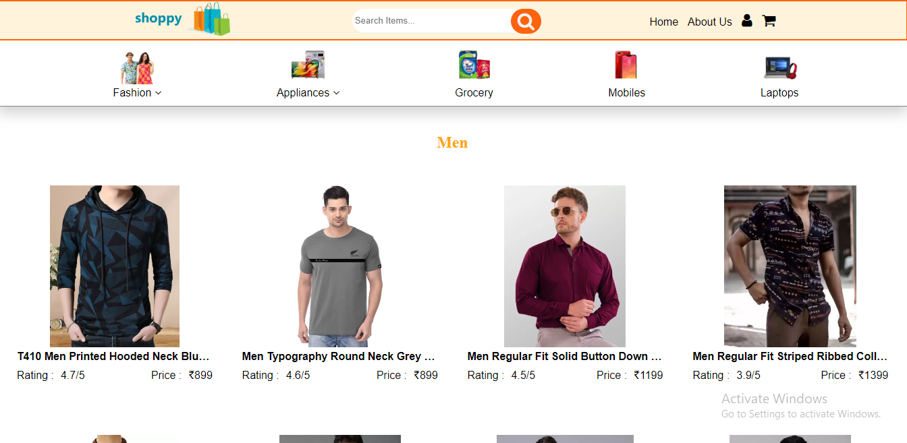
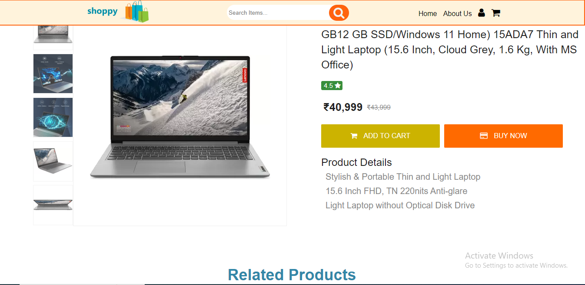
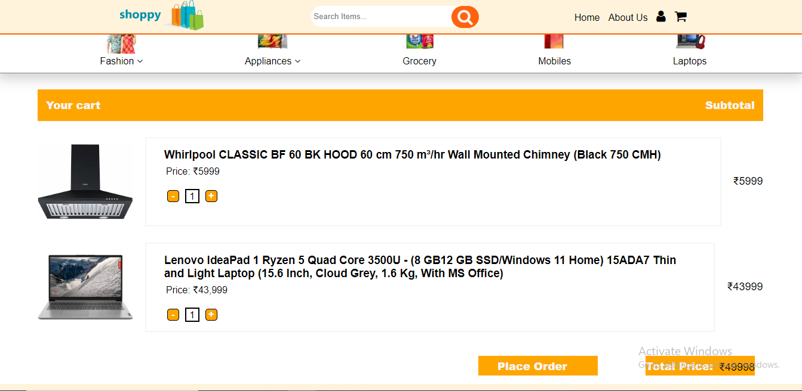

# Shoppy
## Title:
Ecommerce Website name as Shoppy

## Description:
In home page we created nav bar, category bar, Todays deal section, category section, testimonial and footer section.
in this Shoppy website we use different category like grocery, electronics, fashion and home appliances. In each category we have 12 products. In our website we have total 96 products and all the required informatio of product is display on product page like product price, name, discount price and additional detail of product. In product page we also have all image of single product. User has atleast 4-5 images of a single product. In product page we also mention related product of that category along with name and price.
we also created category page, in this page all 12 products are display with single image and price.
Here, we have made a basic eCommerce website with all the basic functionalities like, showing the product, login and signup for users, adding to the cart using local storage and proceeding for checkout.
**Home Page**

--------
**category page**

--------

**product page**

--------

**cart page**

## Project Use:
An e-commerce website is a platform that allows businesses to sell their products or services online to customers around the world. The use of e-commerce websites offers many benefits to both businesses and consumers.

For businesses, e-commerce websites provide a global marketplace where they can reach a larger audience and increase sales. They also offer lower overhead costs compared to physical stores, as there are no rental fees, utility bills, or staff expenses. E-commerce websites also allow businesses to collect valuable data on their customers, such as purchasing habits, preferences, and demographics, which can be used to improve marketing strategies and product offerings.

For consumers, e-commerce websites provide a convenient way to shop for products from the comfort of their own homes, at any time of day or night. They can easily compare prices, read reviews, and make purchases with just a few clicks. E-commerce websites also offer a wider selection of products and services than physical stores, with the ability to browse and purchase products from all over the world.

Overall, the use of e-commerce websites has revolutionized the way businesses operate and how consumers shop, offering benefits to both parties in terms of convenience, accessibility, and cost-effectiveness.

## Team Description:
In this project we have 5 members team and mentor.

Shubhranshu : created home page containing navigation bar, category bar, product container and footer.

Ankit Gupta: created LogIn/SignUp page and the overlay for the LogIn/SignUp container.

Varnit Agrawal : Integrate JSON data to home page and category page, create cart page

Shashank Shekhar: created category page and the 
product card containing product name and discription.

Gaurav: created json data for all the products and product page containing product images and their discription and related product container.

mentor: Jayesh G
Guidance throughout the whole project.
